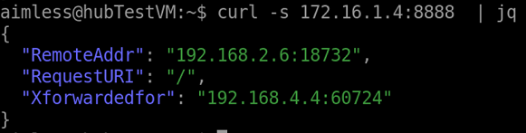

# Light IP Echo

Light IP Echo is a super simple web server which can return client's IP  information as JSON format. 

## Usage

1. Download a binary file from [release page](https://github.com/kongou-ae/light-ip-echo/releases)
1. Set this executable file in your server and run it
2. Access http://[IP address]

## License
MIT
